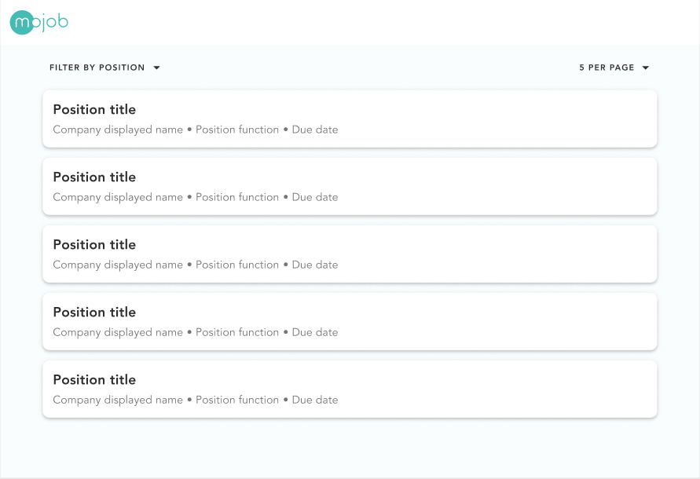
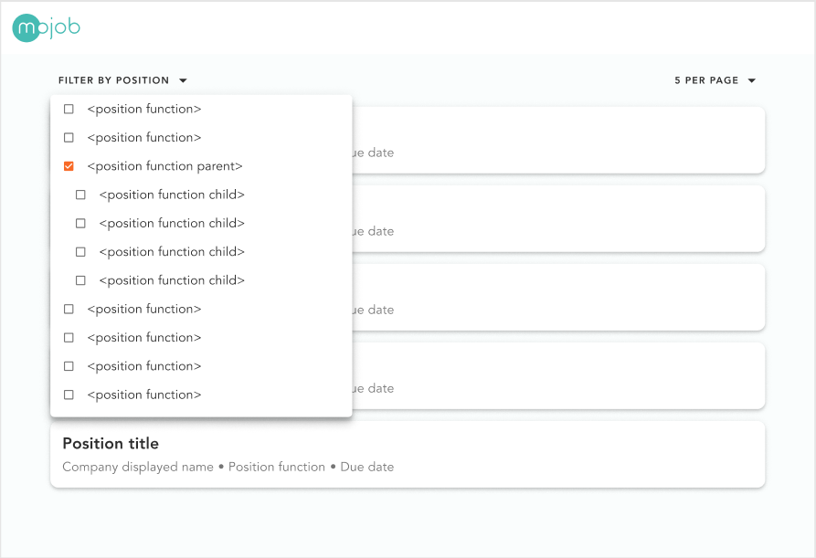
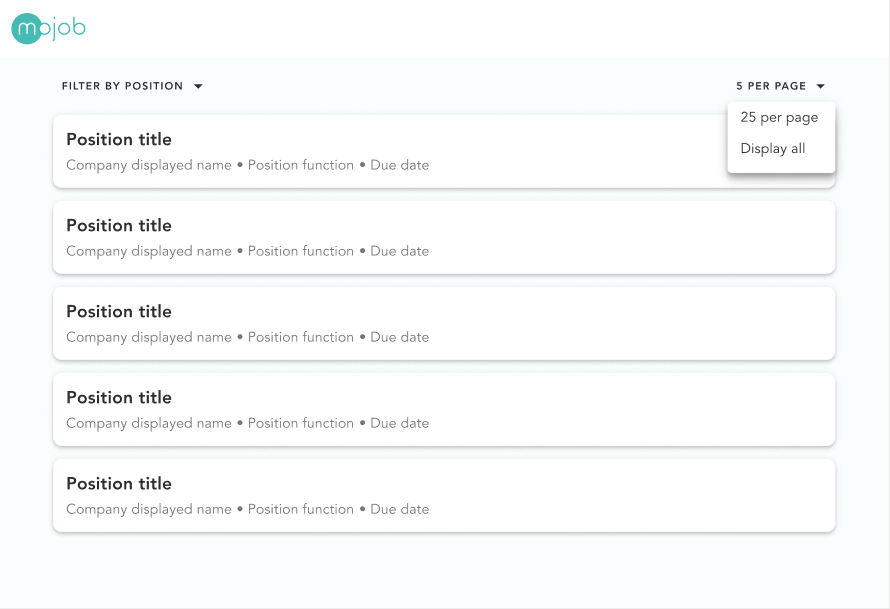

# mojob-job-feed

## The task

We would like you to:
* fetch job listings and display them in a job feed
* create a job position function filter.

All job listings and all job locations can be fetched from our public API.

## The API documentation
https://test-api.mojob.io/public/docs/

You do not need to authorize to use those endpoints.

To test an endpoint you can click on the endpoint, then click "Try it out", then scroll a bit down and click the blue "Execute" button.

We would like you to try to make it look like the given design.

There are hints on how to solve the task in the files inside the src directory.

## Design

[See the full design in Figma](https://www.figma.com/file/kGJR8Mrvsh8uHnniHr22bs/Mojob-s-tree-structure-testing?node-id=0%3A1)

### Design 1

In the design below you can see a list of job listings, position function filtering 
selector and pagination page size selector. 

The data to display in the list of job listings needs to be fetched from our public API.

Notice how that there are no default position function filters set, and that the page size
is set to 5 items per page.



### Design 2

In the design below you can see the position function filtering selector.
We use Position functions to categorize and organize jobs posted on Mojob.
We use the [International Standard Classification of Occupations (ISCO)](https://en.wikipedia.org/wiki/International_Standard_Classification_of_Occupations)

To get you started we have already fetched all position functions from the public API
in `src/Home.vue`.


### Design 3

In the design below you can see the tree structure of the position functions and it
being displayed in the position function filtering selector.

The ISCO standard divides jobs into major groups and sub-major groups.

The jobs can only be connected to sub-major groups, but in the public endpoint to
fetch job listings you can filter on both major groups and sub-major groups.

When fetched from the public API all major position functions will 
contain a `children` field that contains a list  of all sub-major position functions.



### Design 4

Below you can see the pagination page size selector.

In order to decide the number of objects in each page we can use the query parameter
`?page_size=5`

The "Display all" option can be solved in several ways:
* Browse the public API docs and see if you can find `use_pagination` option
* Use the `count` from `IPage` response from the public API
* Use a big `page_size` query parameter number



### Design 5

Below you can see how the text of the "<page_size> PER PAGE" changes when you select a 
new page size option.


## What we expect

* Read through entire README.md before delivering
* Code that works
  - After you have delivered your finished project we are able to run your code.
  - We prioritize functionality and readable code before looks, but our UI/UX designer will be very pleased if the outcome looks similar to the given design.
* Framework
  - We encourage you to use the given Vue project template, but we will rate all submissions equally. The most important thing is that we can run your code easily.
  - You are allowed to use different technologies like Angular or React.
* Language
  - We encourage you to use TypeScript, but JavaScript is also allowed.

## Node + NPM versions
```
Node v12.19.0 (npm v6.14.8)
```

It might be necessary for you to use this version in order to get
this project to install and run properly.

We use [node version manager (nvm)](https://github.com/nvm-sh/nvm) to quickly change node versions. If you are not able to use `nvm` you can either install this specific Node version or you can create a new project with [vue/cli](https://cli.vuejs.org/guide/creating-a-project.html#vue-create) with the Node+NPM-version of your choice.

Remember to let us know at the bottom of this README.md before delivering your project what you chose.

## Project setup

### Command to install dependencies
```
npm install
```
### Command to run the development server
```
npm run serve
```

## Comments

* Use the tools and framework you are comfortable with. 
* After you have delivered your project we will read the code and run the project. 
* We have estimated this task to take 1-2 hours, but you can spend as much time as you like.

## ⚠️ LOOK HERE BEFORE DELIVERING!
1. Please fill in this section before delivering your project

```
I have used node version:
v12.19.0
I have used npm version:
v6.14.8
Javascript framework used:
Vue
If you did not use the given Vue project template, describe how can we run your code:
x y z
Do you have any other comments regarding your deliverable?
x y z
Do you have any comments/feedback about the task we gave you?
x y z
```

2. To deliver your project you can either send us the link to the git project in the Mojob chat or you can send the archived project by email to `bs@mojob.io`.
